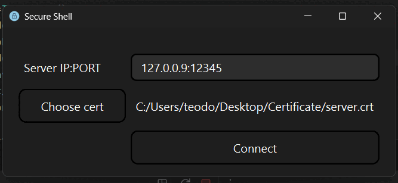
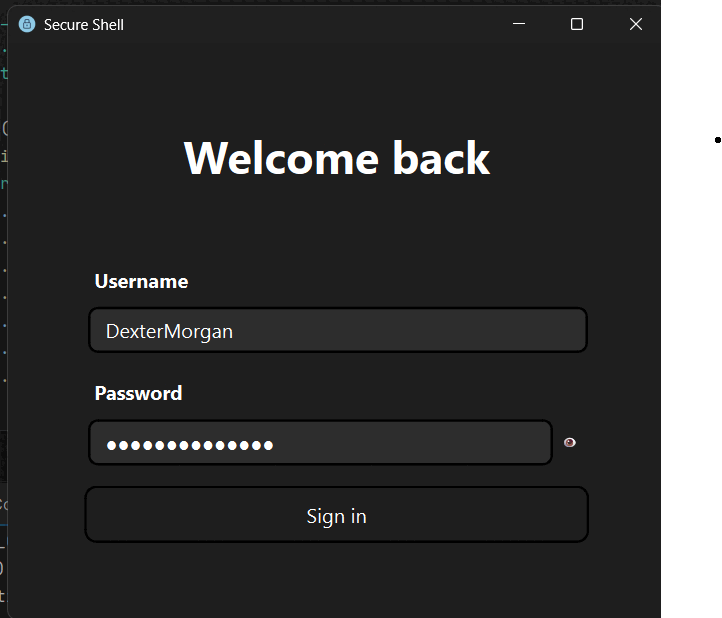

# Secure Shell - GUI Client (PyQt6)

A modern graphical user interface for SSH connections built with PyQt6, providing an intuitive and user-friendly experience for secure remote server management.

## Visual Demonstration

### Application Workflow

#### 1. Server Connection


The connection process demonstrates:
- Entering server IP and port
- Selecting SSL certificate
- Real-time connection feedback
- Visual validation indicators

#### 2. User Authentication


The authentication interface shows:
- Username and password input
- Password visibility toggle
- Login validation
- Smooth transitions between screens

#### 3. SSH Interface & File Management


The main SSH interface features:
- File system navigation
- Console interaction
- File content viewing
- Menu operations
- Real-time command execution

## Educational Purpose

> **⚠️ Important Notice:** This project is developed for **educational purposes only**. It is designed to demonstrate:
> - Custom SSH protocol implementation concepts
> - Secure network communication principles
> - GUI application development with PyQt6
> - TLS/SSL certificate handling
> - Client-server architecture patterns
> 
> This implementation should **not be used in production environments** or for actual secure communications. For production use, please utilize established and thoroughly tested SSH clients like OpenSSH.

## Special Design for Rust Server

> **🔗 Companion Project:** This GUI client is **specifically designed** to work exclusively with the custom SSH server implementation written in **Rust**, which is also part of this repository. 
> 
> - **Custom Protocol**: Uses a proprietary communication protocol tailored for the Rust server
> - **Paired Implementation**: Both client and server were developed together to demonstrate end-to-end secure communication
> - **Educational Ecosystem**: Forms a complete learning environment when used with the Rust server component
> - **Protocol Compatibility**: Will **not** work with standard SSH servers (OpenSSH, etc.) due to custom protocol implementation
>
> To fully utilize this client, you must also run the corresponding Rust server from the same repository.

## Screenshots & Features Overview

| Feature | Description | Visual |
|---------|-------------|--------|
| **Connection Setup** | Secure server connection with certificate validation |  |
| **Authentication** | User login with password visibility controls |  |
| **File Management** | Browse, navigate, and view files with interactive console |  |

## Overview

This GUI application offers a complete interface for secure SSH connections, allowing users to connect to remote servers, navigate file systems, and execute commands through an elegant graphical interface.

## Project Structure

```
client_GUI-PyQt6/
├── main.py                                    # Main entry point
├── backend/
│   └── client.py                             # TLS client for secure connections
├── graphic_user_interface/
│   ├── client_gui.py                         # Main window controller
│   ├── windows/
│   │   ├── connect_window.py                 # Server connection interface
│   │   ├── login_window.py                   # User authentication interface
│   │   └── secure_shell/
│   │       ├── secure_shell_window.py        # Main SSH interface
│   │       ├── top_menu.py                   # Navigation and user menu
│   │       ├── left_menu.py                  # Quick access menu
│   │       ├── file_area.py                  # File browser interface
│   │       ├── content_menu.py               # File content viewer
│   │       └── console.py                    # Interactive command console
│   ├── styles/                               # CSS styling files
│   ├── Assets/
│   │   └── Icons/                            # Application icons
│   └── images-git-readme/                    # Documentation assets
│       ├── connect.gif                       # Connection demo
│       ├── login.gif                         # Login demo
│       └── ssh.gif                           # SSH interface demo
```

## Key Features

### 🔐 Secure Connection Management
- **TLS/SSL Encryption**: Secure communication using certificates
- **Certificate Validation**: Client-side certificate verification
- **Connection Status**: Real-time connection monitoring
- **Custom Protocol**: Designed specifically for the Rust server implementation


### 👤 User Authentication
- **Username/Password Login**: Standard authentication method
- **Password Visibility Toggle**: Enhanced security with show/hide password
- **Session Management**: Secure login/logout functionality


### 📁 File System Navigation
- **Visual File Browser**: Intuitive folder and file icons
- **Context Menus**: Right-click actions for files and directories
- **Navigation Controls**: Back, forward, and refresh buttons
- **Path Display**: Current directory visualization
- **File Content Viewer**: In-app file reading capability

### 💻 Interactive Console
- **Command Execution**: Run shell commands directly
- **Real-time Output**: Live command results display
- **Command History**: Previous commands tracking
- **Clear Function**: Console cleanup with `cls` command

### 👥 User Management
- **Active Users Display**: View currently logged-in users
- **User Menu**: Quick access to user functions
- **Session Control**: Log out and server exit options


## Installation & Setup

### Prerequisites
- Python 3.7+
- PyQt6
- SSL certificates for secure connections
- **The companion Rust server** (from the same repository)

### Installation Steps

1. **Clone the repository:**
```bash
git clone https://github.com/punctIT/Secure-Shell.git
cd Secure-Shell/client_GUI-PyQt6
```

2. **Install dependencies:**
```bash
pip install PyQt6
```

3. **Set up the Rust server** (refer to server documentation in the repository)

4. **Run the application:**
```bash
python main.py
```

## Usage Guide

### 1. Server Connection


1. **Start the Rust server first** (see server documentation)
2. Launch the GUI client application
3. Enter server IP and port (format: `IP:PORT`)
4. Select SSL certificate file (`.crt`, `.cer`, `.pem`, `.der`)
5. Click "Connect"

### 2. User Authentication


1. Enter your username
2. Enter your password (use eye icon to toggle visibility)
3. Click "Sign in"

### 3. File System Navigation


- **Browse files**: Click on folder icons to navigate
- **View file content**: Click on file icons to open content viewer
- **Navigate**: Use back/forward buttons in top menu
- **Refresh**: Update current directory view
- **Home**: Quick return to home directory

### 4. Console Usage
- **Toggle console**: Click "Console" button in left menu
- **Execute commands**: Type commands and press Enter or click "Run"
- **Clear console**: Type `cls` to clear output
- **View output**: All command results displayed in real-time

### 5. User Management
- **View active users**: Click user icon → "Active Users"
- **Log out**: Disconnect from current session
- **Exit server**: Terminate server connection

### Protocol Communication
```python
# Custom protocol format designed for Rust server
client.sent("command_here")
response = client.receive()

# Response format from Rust server
"command_output[-]current_path"
```

## Styling & Customization

The application uses CSS-like styling through PyQt6's stylesheet system:
- `connect_window.css` - Connection interface styling
- `login_window.css` - Authentication interface styling  
- `ssh_window.css` - Main SSH interface styling

## Learning Objectives

This educational project demonstrates:
- **Network Security**: Implementation of TLS/SSL protocols
- **GUI Development**: Modern desktop application design with PyQt6
- **Software Architecture**: Modular design and separation of concerns
- **User Experience**: Intuitive interface design principles
- **Protocol Design**: Custom communication protocol implementation
- **Client-Server Communication**: End-to-end secure communication patterns
- **Cross-Language Integration**: Python client communicating with Rust server

